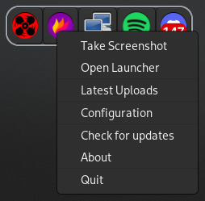

# Gray
**system trays for everyone ⚡**




Gray is an implementation of the SNI protocol (see [this](https://www.freedesktop.org/wiki/Specifications/StatusNotifierItem/)), made to make stuff **super** simple

---

## Installation

### Arch Linux 

From the AUR using your favorite AUR helper

```
yay -S gray-git
```

Or alternatively you can manually build Gray and install it
```sh
meson --prefix=/usr build && sudo ninja -C build install
```
after installing, you can head over to the `examples/` directory and try one of the examples there!
